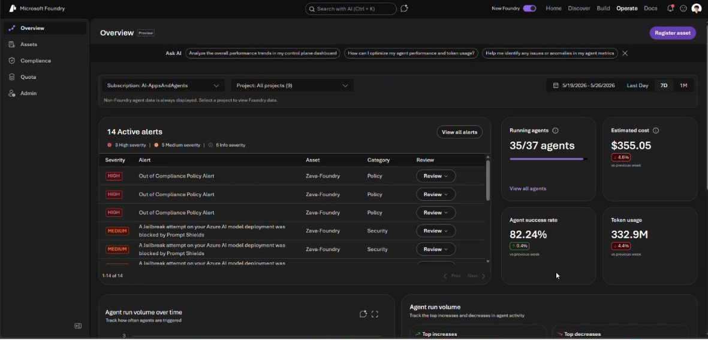
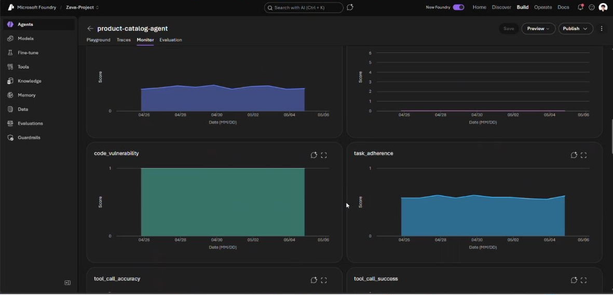
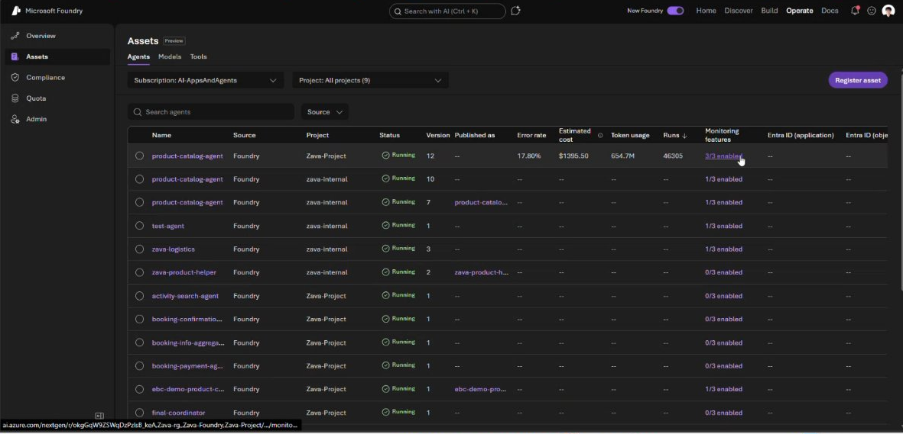

# Foundry Control Plane

Welcome to the Microsoft Build 2026 Foundry Control Plane Expert Meet Up Station! We're thrilled to offer this incredible opportunity for you to connect with attendees through engaging one-on-one or small group conversations about the latest Foundry Control Plane innovations. At the Expert Meet Up, you'll have the chance to answer questions and share your expertise, showcase demos and product decks, and keep attendees informed on the newest event updates and product announcements. Each station will be powered by our outstanding MVPs, session speakers, and subject matter experts—ready to deliver insights and spark meaningful discussions.

## Build 2026 Foundry Control Plane Announcements

* **TBD** LoremIpsum
* **TBD** LoremIpsum
* **TBD** LoremIpsum
* **TBD** LoremIpsum
* **TBD** LoremIpsum
* **TBD** LoremIpsum
* **TBD** LoremIpsum
## Station Roles & Responsibilities

> _Placeholder — update with the Build 2026 expert shift logistics, check-in location, booth ID, conversation counter / Contact Me QR code instructions, and on-site contact for the Foundry Control Plane station._

* Shift Check-In:
* During Your Shift:
* Engagement:
* Demo & Station Deck Prep:
* Professionalism:
* **Click the clicker to keep track of each attendee visiting the booth.**

  <!-- Placeholder: Build 2026 Foundry Control Map station map / signage image -->
  <em>Station map and signage images go here.</em>
    
  <!-- Placeholder: Build 2026 booth photo -->
  <em>Booth photo goes here.</em>
    
  <!-- Placeholder: Build 2026 expert shift schedule -->
  <em>Expert shift schedule goes here.</em>

## Station Resources

During Microsoft Build 2026, you'll have the opportunity to present and share these materials with attendees at the Foundry Control Plane Expert Meet Up Station. Within this `agent-operations-and-management` folder, you will find the following resources:

### Internal

* Build 2026 EMU Foundry Control Plane Know Before You Go (KBYG)
* GENERAL Microsoft Build Expert KBYG Deck.pdf

### Attendee-Facing Deck & Demo

* **Booth rolling deck:** [`foundry-control-plane-booth-deck.pptx`](foundry-control-plane-booth-deck.pptx) — all-white, auto-advancing (9s, looped) kiosk deck for the screen at the station.
* **Talking points & demo walkthrough:** [`TalkingPoints-FoundryControlPlane-booth.md`](TalkingPoints-FoundryControlPlane-booth.md) — the 15-second pitch, the four pillars, buyer personas, the Operate-tab demo flow, and conversation starters.
* **Operate-tab screenshots** (in [`images/`](images/)) for reference:

  
   <em>The Operate tab — agents running, 7-day cost, and severity-ranked alerts.</em>
    
  
   <em>Drill into any agent — quality &amp; safety evals tracked over time, red-teaming built in.</em>
    
  
   <em>Whole-fleet coverage — Foundry-native + open-source / third-party, with Defender risk levels.</em>

* Demo Link: <https://aka.ms/foundrycontrolplane-demo>
* Code-first walkthrough: 

### Documentation Links

More will be announced on the day of Build 2026.

* <https://aka.ms/FoundryControlPlane>

## Build 2026 Foundry Control Plane Sessions

Booth-related sessions, curated from the EMU Tracker (Session Map booth mapping + AI Schedule title/abstract relevance) and grouped by theme. Full abstracts and where-to-send-attendees notes are in [`TalkingPoints-FoundryControlPlane-booth.md`](TalkingPoints-FoundryControlPlane-booth.md).

### Observe & Operate

| Code | Type | Title |
|------|------|-------|
| BRK252 | Breakout | From observability to ROI for AI agents |
| LAB540 | Lab | Observe, optimize & protect hosted agents |
| LTG429 | Lightning | Debug & operate agents with Azure Monitor |
| LTG451 | Lightning | Agentic FinOps: cost & quality in Foundry |

### Govern & Control Plane

| Code | Type | Title |
|------|------|-------|
| BRK251 | Breakout | Secure, enterprise-ready agents with Agent 365 |
| OD840 | Pre-recorded | Enable enterprise agents with Agent 365 SDK |
| OD831 | Pre-recorded | Govern models, tools & agents with API Management |
| LTG467 | Lightning | Secure AI agents: AI Gateway, tools & trust |

### Guardrails, Evals & Trust

| Code | Type | Title |
|------|------|-------|
| BRK250 | Breakout | Govern open-source AI agents, any framework |
| LTG430 | Lightning | Shield your agents: universal control layer |
| TT682 | Table Talk | Trusted AI built for production |
| DEM369 | Demo | Responsible AI: principles to engineering |
