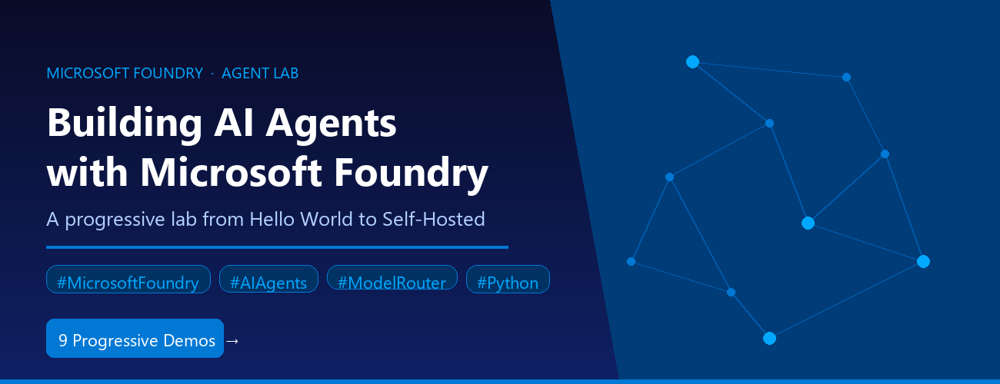

# Model Selection and Routing

## [Foundry-Agent-Lab](https://github.com/microsoft-foundry/Foundry-Agent-Lab)

A progressive series of hands-on demos showing how to build AI agents with the Microsoft Foundry SDK. Each demo builds on the previous one, adding exactly one new concept at a time — from a simple prompt agent to function calling, desktop/web UIs, built-in web search, code interpretation, RAG with file search, MCP integration, centralized toolbox governance, and self-hosted agent servers. All demos use Model Router as their default model deployment, demonstrating zero model-selection overhead, automatic quality routing, and significant cost efficiency across diverse agent tasks without any routing logic in your code.

**Companion blog post:** [Building AI Agents with Microsoft Foundry: A Progressive Lab from Hello World to Self-Hosted](https://techcommunity.microsoft.com/blog/azuredevcommunityblog/building-ai-agents-with-microsoft-foundry-a-progressive-lab-from-hello-world-to-/4521792) — walks through each demo's code in depth, covering architecture principles, Model Router empirical routing data, security considerations, and guidance on when to use each tool pattern.

### Demo Summary

| # | Folder | Description | Concept | Tool | UX | Default Model |
|---|--------|-------------|---------|------|----|---------------|
| 0 | `hello-demo/` | Simplest prompt agent — chat in the terminal | Agent creation, conversations, Responses API | None | Terminal | Model Router |
| 1 | `tools-demo/` | Function calling with a live weather API | Function tools, tool-calling loop, live API integration | FunctionTool | Terminal | Model Router |
| 2 | `desktop-demo/` | Same agent, desktop GUI window | Same agent with a different UI (CLI → desktop) | None | Desktop (Tkinter) | Model Router |
| 3 | `websearch-demo/` | Built-in web search with citations | Built-in tools (server-side), no client tool loop needed | WebSearchTool | Terminal | Model Router |
| 4 | `code-demo/` | Code interpreter with Gradio web UI | Code execution in sandbox, web UI with Gradio | CodeInterpreterTool | Web (Gradio) | Model Router |
| 5 | `rag-demo/` | File search grounded in your documents (RAG) | Document upload, vector stores, RAG grounding | FileSearchTool | Terminal | Model Router |
| 6 | `mcp-demo/` | External tools via Model Context Protocol | MCP servers, human-in-the-loop approval, open standard | MCPTool | Terminal | Model Router |
| 7 | `toolbox-demo/` | Centralized tool governance via Toolbox | Toolbox versioning, curated tool subsets, single MCP endpoint | Toolbox (GitHub Issues + Repos) | Terminal | Model Router |
| 8 | `hosted-demo/` | Self-hosted agent with Responses protocol | Custom agent server, streaming, deploy to Foundry container hosting | None (custom server) | Terminal + Agent Inspector | gpt-4.1-mini |

## [Model-Router-Auto-Evaluation](https://github.com/microsoft-foundry/Model-Router-Auto-Evaluation)

Want to test whether Model Router will actually save you money on your workload? This open-source toolkit lets you benchmark Microsoft Foundry's Model Router against any baseline model on quality, cost, and latency — bring your own prompts and get a full side-by-side report in one command. It includes a no-keys-needed quickstart with mock data, an interactive Jupyter walkthrough, and scales to 1,000+ prompts with built-in checkpointing and resume.

Whether you're evaluating Model Router for production or just exploring what it can do, this is the fastest way to get hands-on with real metrics. Clone the repo, run the demo script, and open the self-contained HTML dashboard to see quality scores, cost breakdowns, and latency percentiles — no Azure credentials required to get started.

---

# Demo Videos

## Model Router Tour

<video src="https://github.com/user-attachments/assets/fafdeede-369e-4683-a775-935b1e271ae5" controls width="100%"></video>

This video is an ambient walkthrough of a live demo for the model router — an intelligent AI routing system that automatically selects the best AI model for each query based on the task at hand.

The demo guides viewers through a side-by-side comparison of the model router against a fixed benchmark model (GPT-5.2), to illustrate how routing decisions are made. Viewers follow along as the system routes the request through a balanced configuration.

The demo covers four key comparison dimensions:

- **Response Quality** — side-by-side view of the Model Router's response vs. the benchmark, with full JSON metadata
- **Latency** — the Model Router clocks in at ~12,885ms vs. the benchmark's ~21,375ms, showing a 1.7× speed improvement
- **Cost** — a detailed cost breakdown comparing token usage and pricing between routing strategies
- **Accuracy** — an automated evaluation that grades response quality across both approaches

## Model Router Demo (no sound)

<video src="https://github.com/user-attachments/assets/470416cc-b2fe-4b0e-995e-8d19649b9b13" controls width="100%"></video>

In this video, the model router is tasked with selecting the most cost-efficient and performant language model for a given task, then benchmarks it against a standard model.

In the demo, the user selects the Marketing department and the Campaign Performance Summary scenario, which auto-fills a prompt asking to summarize last month's email campaign performance (Complexity: Medium, Quality Expectation: Moderate accuracy). After submitting, the router picks the optimal model for the task and returns a detailed campaign breakdown.

The video culminates in a Cost Savings Analysis, where the results are striking: the model router cost $0.000538 versus the benchmark's $0.041815 — a 98.7% cost reduction — while also being 3.8x faster (7,284 ms vs. 27,648 ms).

## Model Router: Zava Chatbot Demo

<video src="https://github.com/user-attachments/assets/742b488b-73d9-48b3-8e83-2db1b7aa8488" controls width="100%"></video>

This video walks through using the Model router Foundry Models and demonstrates how it intelligently routes queries to the most capable and cost-efficient AI model in real time based on complexity and performance. Using a fictional smart sportswear brand called Zava, the demo shows a customer-facing chatbot powered by the model router dynamically selecting different underlying models depending on whether a query is simple or complex. Watch how the model router achieves 10.5x faster latency at a fraction of the cost with comparable accuracy, all within the Microsoft Foundry.