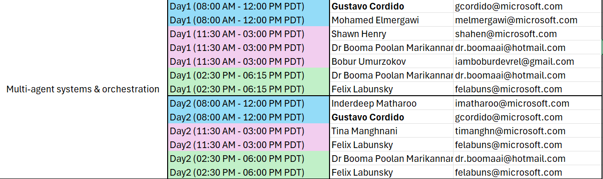

# Multi-Agent Systems and Orchestration

Welcome to the Microsoft Build 2026 Multi-Agent Systems and Orchestration Expert Meet Up Station. Use this document as the station handoff template for experts: announcements, demo flow, key talking points, and follow-up links.

## Contents

- [Build 2026 Announcements](#build-2026-multi-agent-systems-and-orchestration-announcements)
- [Station Resources](#station-resources)
- [Documentation Links](#documentation-links)
- [Related Build Sessions](#related-build-2026-sessions)
- [FAQ Prompts (Booth Ready)](#faq-prompts-booth-ready)

## Build 2026 Multi-Agent Systems and Orchestration Announcements

* **Microsoft Agent Framework: Agent Harness - General Availability (GA)** 
* **Microsoft Agent Framework: Github Copilot and Claude Code Connectors - GA** 
* **Foundry Agent Service: Hosted Agents - GA SOON** 
* **Publishing Foundry Agents to Teams and M365 Copilot - GA** 

## Station Resources

### Attendee-Facing Deck

* [Microsoft Agent Framework Deck](https://onedrive.cloud.microsoft/:p:/a@8hj92zm6/S/cQq4vVxy7D4zRrLJZ6hZwaPfEgUC9Jpcf82DN0Ldz73X78uCjw)

### Demos

* [Building Multi-Agent Applications with Microsoft Agent Framework Workflow (Needs recording)](https://github.com/microsoft/Agent-Framework-Samples/blob/main/07.Workflow/README.md)
* >Hosted Agents Placeholder, waiting for access from PG

## Documentation Links (to be updated as they're published, before first shift)

Replace with final public links when published:

* Terraform Blog - [Infrastructure as Code for AI: Building and Deploying Microsoft Hosted Agents with GitHub](https://techcommunity.microsoft.com/blog/AzureDevCommunityBlog/infrastructure-as-code-for-ai-building-and-deploying-microsoft-hosted-agents-wit/4523389/edit)
* GitHub Blog - [Building and Operating a Microsoft Foundry Hosted Agent with GitOps and GitHub](https://techcommunity.microsoft.com/blog/azuredevcommunityblog/building-and-operating-a-microsoft-foundry-hosted-agent-with-gitops-and-github-t/4523393?previewMessage=true)
* [Agent Framework Samples](https://github.com/microsoft/Agent-Framework-Samples/tree/main)

## Related Build 2026 Sessions

| Code | Title | Day | Time | Notes |
|---|---|---|---|---|
| BRK243 | Claw and agent harness in Microsoft Foundry | Wed, Jun 3 | 11:30 AM - 12:15 PM PDT | Agent harness and orchestration patterns. |
| LAB530 | Engineering agents that reason, act, and adapt | Tue, Jun 2 Tue, Jun 2 Tue, Jun 2 Wed, Jun 3 | 12:30 PM - 1:45 PM PDT 4:45 PM - 6:00 PM PDT 8:15 PM - 9:30 PM PDT 3:00 PM - 4:15 PM PDT | Covers adaptive agent design patterns and practical engineering tradeoffs for multi-agent systems. |
| DEM365 | Building a Multi-Agent Workflow in Microsoft Fabric | Wed, Jun 3 | 12:20 PM - 12:45 PM PDT | Directly aligned to workflow orchestration and cross-agent coordination scenarios. |

## Full Booth Shifts:

## Possible FAQ (will expand)

* "When should I use multi-agent instead of a single agent?"
* "How do I control costs and latency with multiple agents?"
* "What does production observability look like for orchestration?"
* "How do human approvals work across agent handoffs?"
* "What is the minimum architecture to get started this week?"

